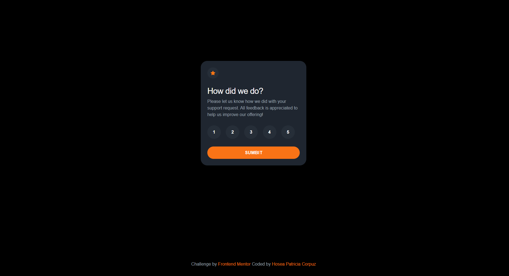

# Frontend Mentor - Interactive Rating Component

### Screenshot

### Built with

- Vue 3 + Vite
- Tailwind CSS 

### The challenge

Users should be able to:

- Select and submit a number rating
- See the "Thank you" card state after submitting a rating
- See hover and focus states for all interactive elements on the page
